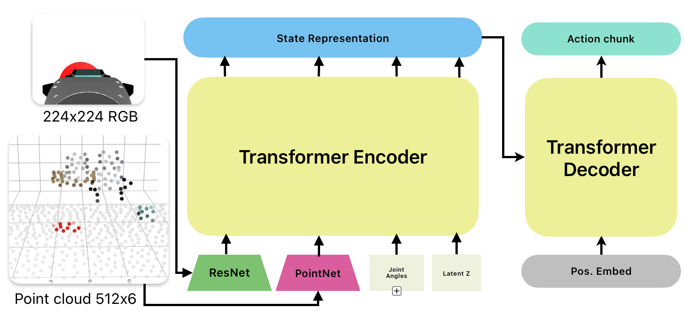

# 3DEgoACT: Viewpoint-Invariant Manipulation via 3D Geometric Priors

**3DEgoACT** is a robust imitation learning policy designed to solve the "viewpoint failure" problem in robotic manipulation. By fusing sparse 3D point clouds with 2D egocentric visual cues, this model achieves significant robustness to camera perturbations where standard policies (like ACT) fail.

## 📖 Overview

Standard imitation learning methods, such as the Action Chunking Transformer (ACT), excel at encoding human dexterity but are brittle to camera shifts.

**3DEgoACT** addresses this by introducing a hybrid architecture:

* **Global Geometry:** Uses a PointNet encoder to process a downsampled 3D point cloud, providing a viewpoint-invariant spatial prior.

* **Local Precision:** Retains an egocentric (Eye-in-Hand) RGB view encoded via ResNet for fine-grained manipulation capability.

* **Efficiency:** Designed for low-cost deployment, running at ~14 actions/s on MacBook M1 Pro.

## 🏗️ Architecture

The model extends the standard ACT architecture by adding a parallel 3D encoding stream.

<p align="center"></p>

1. **Inputs:**
* **Egocentric View:**  RGB image from the wrist camera (EEF), providing local texture and depth cues for grasping.

* **Point Cloud:** A  (RGBXYZ) sparse point cloud, generated from a front-facing RGB-D camera and downsampled via Farthest Point Sampling (FPS).

* **Proprioception:** 7D state vector (6 joint angles + gripper state).

2. **Encoders:**
* **ResNet-18:** Encodes the egocentric image.
* **PointNet:** Embeds the point cloud into a 512 dimensional token.

3. **Fusion:** The 3D geometric token is fused with 2D visual features and proprioception via a Transformer Encoder.

4. **Action Head:** Standard ACT Transformer Decoder predicts a chunk of future actions.

## ⚙️ Environment & Setup

The project is built on the **LeRobot** codebase and simulates a 7-DoF xArm manipulator in **MuJoCo**.

### Observation Space

* **Front Camera (Static):** Used only to generate the point cloud.
* **Wrist Camera (Dynamic):** Used for live visual feedback.
* **Proprioception:** Joint positions and gripper status.

### Action Space

* 4D Control Vector:  (End-effector Cartesian delta + Gripper command).

### Dataset

Dataset was recorded by teleoperation using an XBox controller. Dataset is available at [rishabhrj11/gym-xarm-pointcloud](https://huggingface.co/datasets/rishabhrj11/gym-xarm-pointcloud).
Dataset stores 
1. Front, left and right allocentric views
2. Egocentric EEF camera
3. FPS downsampled 512x6 RGBXYZ point cloud from front allocentric view

<!--
## 🚀 Installation

```bash
# Clone the repository
git clone https://github.com/yourusername/3DEgoACT.git
cd 3DEgoACT

# Create a conda environment
conda create -n egoact python=3.10
conda activate egoact

# Install dependencies (requires LeRobot and MuJoCo)
pip install -r requirements.txt
pip install lerobot gymnasium mujoco

```
-->
## 📊 Performance & Results

We evaluated 3DEgoACT against a strong ACT baseline on a pick-and-place task. While the baseline collapsed when the camera was moved to "Left" or "Right" positions, 3DEgoACT maintained high success rates.

| Model | Camera View | Reach Success | Pick Success | Place Success |
| --- | --- | --- | --- | --- |
| **Baseline ACT** | Front (Train) | 90% | 80% | 54% |
|  | **Left (Unseen)** | **8%** | **0%** | **0%** |
|  | **Right (Unseen)** | **6%** | **0%** | **0%** |
| **3DEgoACT** | Front (Train) | 96% | 88% | 60% |
|  | **Left (Unseen)** | **96%** | **72%** | **54%** |
|  | **Right (Unseen)** | **94%** | **76%** | **50%** |

Data sourced from Table I of the report.

### Ablation Study

Removing the **Egocentric Camera** resulted in 0% pick success, despite perfect reaching. This confirms that while the point cloud handles global navigation, the wrist camera is critical for the final grasp.

## 🏋️ Training

The model was trained for 100 epochs with the following configuration:

* **Batch Size:** 912
* **Learning Rate:**  (Cosine Annealing)
* **Optimizer:** AdamW (Weight Decay 0.01)
* **Chunk Size:** 50
* **Hardware:** Single NVIDIA L4 GPU
